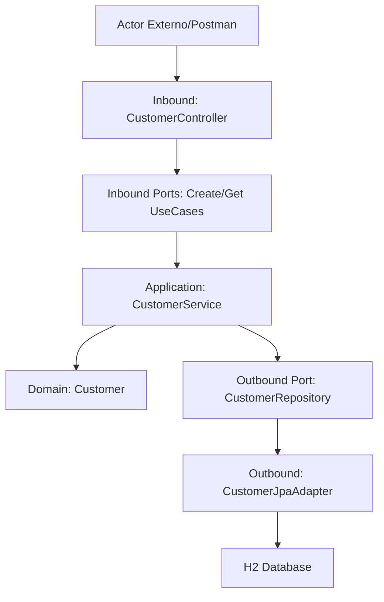

# Customer Management Microservice - Reto Técnico Cloud

Este proyecto implementa un microservicio para la gestión de clientes, diseñado bajo principios de **Arquitectura Hexagonal** y preparado para despliegues nativos en la nube (**Google Cloud Run**).

## 🌐 Enlaces del Proyecto (Cloud)

### 🚀 PRODUCCIÓN
*   **URL Base:** https://customers-api-prod-1091020309852.us-central1.run.app
*   **Endpoints:**
    *   `GET https://customers-api-prod-1091020309852.us-central1.run.app/api/customers`
    *   `POST https://customers-api-prod-1091020309852.us-central1.run.app/api/customers`
*   **Documentación (Swagger):** [Swagger UI PROD](https://customers-api-prod-1091020309852.us-central1.run.app/swagger-ui/index.html#/customer-controller/createCustomer)

### 🧪 DESARROLLO
*   **URL Base:** https://customers-api-dev-1091020309852.us-central1.run.app
*   **Endpoints:**
    *   `GET https://customers-api-dev-1091020309852.us-central1.run.app/api/customers`
    *   `POST https://customers-api-dev-1091020309852.us-central1.run.app/api/customers`
*   **Documentación (Swagger):** [Swagger UI DEV](https://customers-api-dev-1091020309852.us-central1.run.app/swagger-ui/index.html)

---

## 🚀 Tecnologías
*   **Java 21 (LTS)**
*   **Spring Boot 3.4.x**
*   **Maven**
*   **Docker** (Multi-stage build)
*   **Terraform** (Infraestructura como Código)
*   **H2 Database** (Persistencia embebida)

## 🏗️ Arquitectura
El sistema utiliza el patrón de **Puertos y Adaptadores (Hexagonal)** para aislar la lógica de negocio de la infraestructura:


## ⚙️ Gestión de Ambientes (Profiles)
La aplicación cambia su comportamiento dinámicamente según el perfil de Spring activo:

| Perfil | Puerto | Nombre App | Log de Inicio |
| :--- | :--- | :--- | :--- |
| **dev** | 8080 | customers-dev | Ejecutando en DEV |
| **prod** | 9090 | customers-prod | Ejecutando en PROD |

## 🛠️ Ejecución Local

### 1. Compilación y Empaquetado
```bash
cd customers-api
./mvnw clean package -DskipTests
```

### 2. Ejecución de la Aplicación
Puedes alternar entre ambientes usando los perfiles de Spring:

**Modo Desarrollo (Puerto 8080):**
```bash
java -jar target/customers-0.0.1-SNAPSHOT.jar --spring.profiles.active=dev
```

**Modo Producción Simulado (Puerto 9090):**
```bash
java -jar target/customers-0.0.1-SNAPSHOT.jar --spring.profiles.active=prod
```

### 3. Ejecución de Pruebas (Tests)
Para validar la integridad del código y los contratos de la API:

**Ejecutar todos los tests:**
```bash
./mvnw test
```

**Ejecutar una clase de test específica:**
```bash
./mvnw test -Dtest=CustomersApplicationTests
```

**Generar reporte de cobertura (si aplica):**
```bash
./mvnw verify
```

## 🐳 Ejecución con Docker (Paralelo)
Asegúrate de tener Docker instalado y ejecutándose en tu Mac.

### 1. Construir la Imagen (Inmutable)
Este comando genera una única imagen que sirve para todos los ambientes:
```bash
docker build -t customers-api .
```

### 2. Ejecutar Ambientes en Paralelo
Puedes levantar ambos contenedores simultáneamente. Cada uno tendrá su propia base de datos H2 independiente y su propio puerto:

**Levantar Ambiente DEV (Puerto 8080):**
```bash
docker run -d --name customers-dev \
  -e "SPRING_PROFILES_ACTIVE=dev" \
  -p 8080:8080 \
  customers-api
```

**Levantar Ambiente PROD (Puerto 9090):**
```bash
docker run -d --name customers-prod \
  -e "SPRING_PROFILES_ACTIVE=prod" \
  -p 9090:9090 \
  customers-api
```

### 3. Comandos de Gestión
*   **Ver contenedores activos:** `docker ps`
*   **Ver logs de un ambiente:** `docker logs -f customers-dev` o `docker logs -f customers-prod`
*   **Detener ambientes:** `docker stop customers-dev customers-prod`

## ☁️ Despliegue en la Nube (GCP Cloud Run)

El proyecto cuenta con un pipeline de **CI/CD** automático:
*   **A Desarrollo:** Se despliega al hacer merge/push a la rama `develop`.
*   **A Producción:** Se despliega al hacer merge/push a la rama `main`.

### Despliegue Manual a DEV
Si necesitas forzar un despliegue al ambiente de desarrollo desde cualquier rama (sin hacer merge), usa este comando:
```bash
gh workflow run "Java & Terraform Multi-Env CI/CD" --ref $(git branch --show-current)
```

---

## 🛡️ Seguridad y Calidad
*   **Secrets:** No se almacenan credenciales en el código fuente.
*   **Datos:** Se utilizan datos ficticios para todas las pruebas.
*   **.gitignore:** Configurado para excluir artefactos, estados de Terraform y archivos .env.
